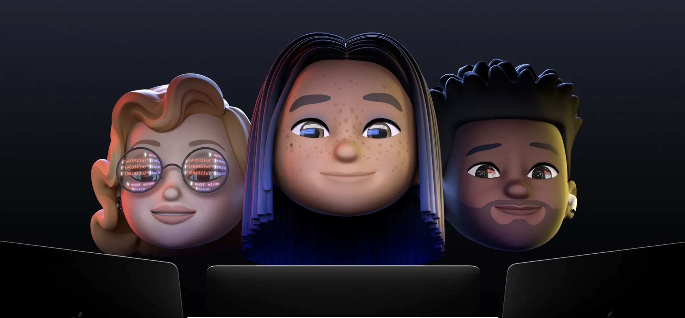

# WWDC21 Swifty Bits

---

# iPad Swift Playground

You can now develop and submit SwiftUI apps(*) from iPad.

(*) For iOS and iPad apps only.

---

# TestFlight for macOS

---

# Xcode Cloud

---

# Swift `async`/`await`

---

# TextKit 2

---

# `UITextView` built-in OCR

---

# Xcode Vim Binding

---

# `UIKeyboardLayoutGuide`

---

# `NSAttributedString` supporting Markdown

---

# Obj-C constant literals

```
clang -fobjc-constant-literals
```

```
#import <Foundation/Foundation.h>

static NSNumber * const luckyNumber = @7;
static NSArray * const favoriteFoods = @[@"🍜", @"🍕", @"🍛", @"🍔", @"🍍"];
static NSDictionary * const peopleByBirthMonth = @{
  @"February": @[@"Steve Jobs”],
  @"August": @[@"Woz”],
  @"October": @[@"Bill Gates”],
  @"December": @[@"Ada Lovelace", @"Grace Hopper"],
};

int main(int argc, char *argv[]) {
  @autoreleasepool {
    NSLog(@"%@", luckyNumber);
    NSLog(@"%@", favoriteFoods);
    NSLog(@"%@", peopleByBirthMonth);
  }
}
```

---

# SF Symbols 3

---



---

# LIVE near WWDC 2021

https://livenearwwdc.com/
