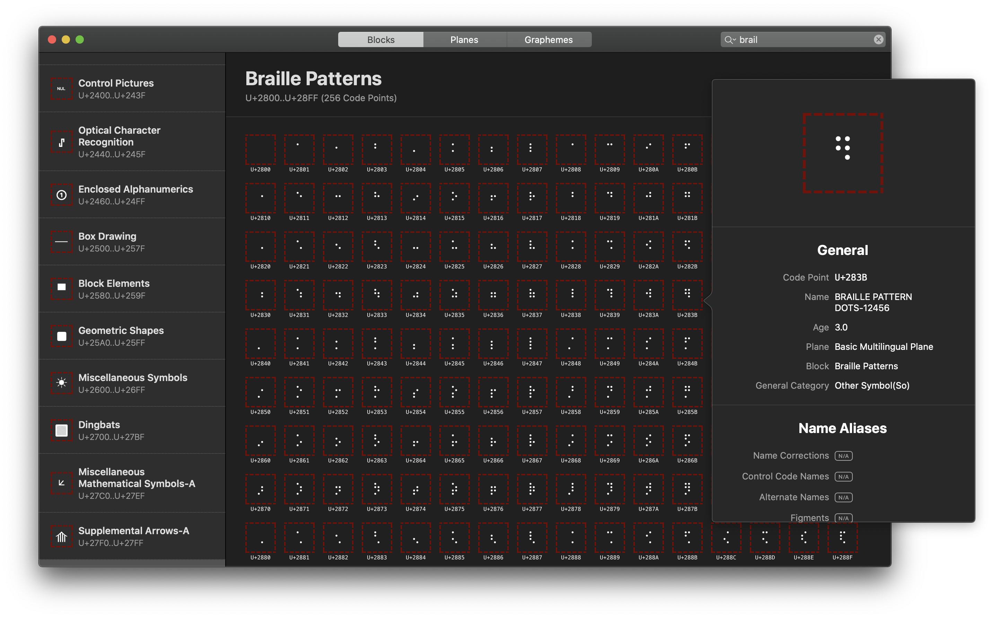
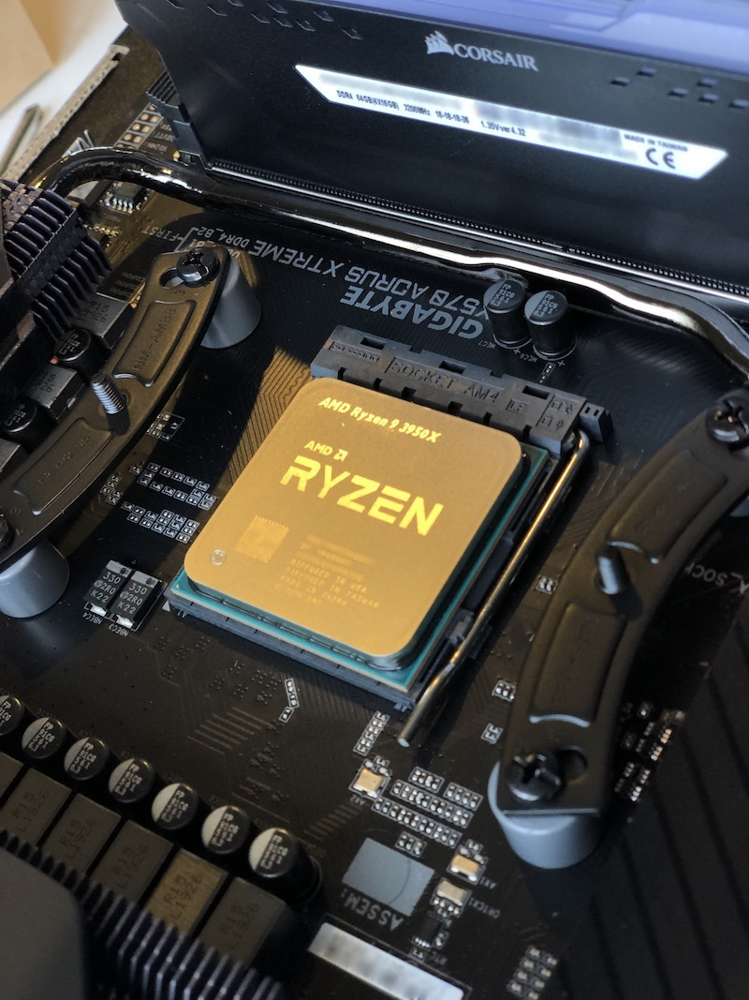
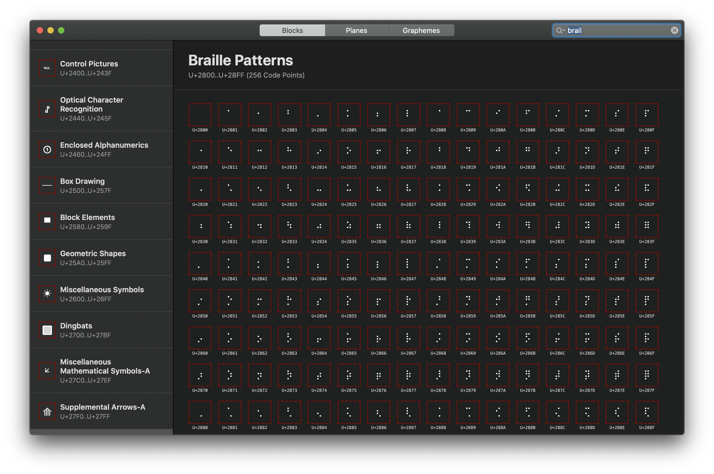

# **Building cicero-tui**

A Unicode tool for the terminal

_Yan Li_

---

# About Cicero

- My side project for fun
- Named after _Marcus Tullius Cicero (Rome, 106 BC - 43 BC)_
- A Unicode tool
    - Split a Unicode string into Grapheme Clusters
    - Browse through all Unicode blocks and plans
    - Search character by Unicode Name
- Available for free on:
    - macOS and iOS (GUI)

---

---

# But I use Linux now :(

**AMD YES!**

_(It builds LLVM with `-j32`, and completes within 10 mins)_

---

# Let's build a Cicero for Linux

---

# Building blocks of a Unicode tool (macOS/iOS)

- Unicode data and algorithms (Bring your own)
- Character preview
    - Find fonts on a system (e.g. `CTFont`)
    - Convert fonts to bitmaps (e.g. `CTLine`)
- Search
    - Full text search for Unicode name (Bring your own)
- Views (AppKit/UIKit)
    - Label and text input with Unicode support (e.g. `NSTextField`, `UILabel`)
    - List or Table (e.g. `NSTableView`, `UICollectionView`)
    - Windowing and user event handling (Cocoa)
    - A canvas to draw pixels on (`CALayer`)

---

# Building blocks of a Unicode tool (Linux)

- Same as the previous slide (Bring your own)

---

# Building blocks of a Unicode tool (Linux)

- Unicode data and algorithms (rust-unic, libicu)
- Character preview
    - Find fonts on a system (fontconfig)
    - Convert fonts to bitmaps (freetype, harfbuzz)
- Search
    - Full text search for Unicode name (SQLite)
- Views (GTK, Qt, ...Electron) `<=== Hmmm...`
    - Label and text input with Unicode support
    - List or Table
    - Windowing and user event handling
    - A canvas to draw pixels on

---

# Why TUI

- I don't want to rewrite the GUI for Cicero for the 3rd time
- Inspied by [7sDream/fontfor](https://github.com/7sDream/fontfor)
- I prefer to use terminal in most of my daily workflows
- It's usable everywhere
    - Linux and macOS have great terminals
    - It's 2020, even Windows now has a good terminal, and it has a subsystem for Linux

---

# Let me show you cicero-tui

---

# Building blocks of cicero-tui

- ~~Unicode data and algorithms~~ (rust-unic)
- Character preview
    - Find fonts on a system (fontconfig)
    - Convert fonts to bitmaps (freetype)
- ~~Search~~ _Not planned_
- Views (tui-rs and crossterm)
    - Label and text input with Unicode support (`tui::widgets::Text`)
    - List or Table (`tui::widgets::List`)
    - Windowing and user event handling (`crossterm::event`)
    - A canvas to draw pixels on (`tui::widgets::canvas`)

---

# So where do we start?

What's a UI's responsibility?

---

# What's a UI's responsibilty?

Accepting user inputs

- Change application state in response to events

Producing human understandable outputs

- Draw stuff according to application state

---

# An oversimplified view of a macOS app's GUI

If you set a break point in:

- `[YourNSViewSubclass drawRect:]`
- Or `[YourNSViewSubclass mouseDown:]`

Then you will observe:

- `main()`
    - `[NSApplication run]`
        - `CFRunLoopRun`
            - `[NSView drawRect:]`
        - `[NSApplication sendEvent:]`
            - `[NSView mouseDown:]`

_There is even [a song](https://www.youtube.com/watch?v=X0AcrL6vHE8) about this. And [here](https://jamesdempsey.net/i-love-view/) are the lyrics._

---

# An oversimplified view of a GUI application

- `main()` entered
    - Initialize app state
    - Prepare root view
    - Start a loop that ticks _n_ times per second
        - Draw views according to static code and dynamic app state
        - Change app state according to events
            - User input or other pre-defined flow
        - Should keep running?
    - Loop exited
    - Release all resources
- `main()` exited

---

# An overview of cicero-tui

- `main()` entered
    - Parse arguments
        - `cli`
            - Generate and print output; `main()` exited
        - `tui`
            - Initialize app state
            - Prepare root view
            - Start a loop that ticks per user input
                - Draw views according to static code and dynamic app state
                - Change app state according to user input events
                - Should keep running?
            - `main()` exited

---

# Let me show you the code

(Sorry about the Rust)

---

# Building blocks of cicero-tui

- ~~Unicode data and algorithms~~ (rust-unic)
- Character preview
    - Find fonts on a system (fontconfig)
    - Convert fonts to bitmaps (freetype)
- ~~Search~~ _Not planned_
- ~~Views~~ (tui-rs and crossterm)

---

# fontconfig, freetype, and HarfBuzz 

(Oversimplified, pseudo code)

- What's a font?
    - `Map<UInt32, Shape> where Shape is BezierPath or Bitmap`
- What's a Glyph?
    - `struct { bitmap: [[UInt8]], /* metrics */ }`
- What do I use fontconfig for?
    - `fn (code_point: UInt32) -> (font_files: [String])`
- What do I use freetype for?
    - `fn (code_point: UInt32, font_file: String) -> Optional<Glyph>`
- HarfBuzz (not used in cicero-tui, but very cool)
    - `struct GlyphRun { glyphs: [Glyph], /* metrics for the run */ }`
    - `fn (string: [UInt32], font_file: String) -> GlyphRun`

---

# Drawing the "pixels"

---

---

# Ideas for the future

- Complex character shaping with HarfBuzz
- GPU text rendering
    - Vulkan
    - Signed distance fields
    - Vector based GPU text rendering

---

# Thank you

github.com/eyeplum/cicero-tui
